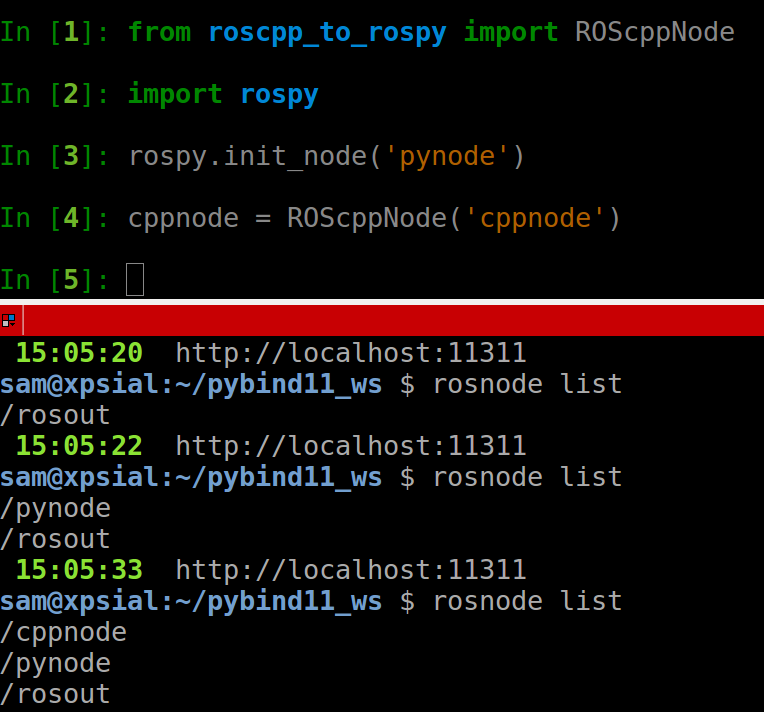

# roscpp_to_rospy

Exposing roscpp classes for Python made easier, using pybind11. (Or that's the goal, work in progress).

# Progress

Right now I got a ROS node + NodeHandle that can be instantiated from Python

In the same process, given a different name to both nodes, a Python Node and a C++ Node can live at the same time, as in the screenshot.

